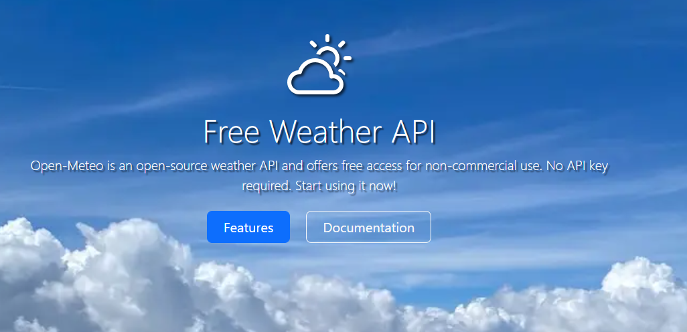

  

# Table of Contents

- [Plan](#plan)
  - [Task 1](#task-1)
    - [Project Planning](#project-planning)
    - [Structure](#structure)
    - [Content](#content)
    - [Functionality](#functionality)
  - [Task 2](#task-2)
    - [Refreshing API Knowledge](#refreshing-api-knowledge)

## Plan

### Task 1

#### Project Planning

* **API Selection**: Open-Meteo weather API.
* **Project Topic**: Building a weather forecasting site that displays current weather conditions and forecasts for different locations.

#### Structure

* **GitHub Repository**: Create a public repository to host the project code.
* **HTML Document**: Design a simple yet intuitive layout for displaying weather data.
* **CSS Document**: Style the webpage to be responsive and visually appealing.
* **JavaScript File**: Write scripts to fetch and display data from the Open-Meteo API. For testing purposes Scripts will be included in HTML.
* **README File**: Document the setup and usage instructions clearly.

#### Content

* **Data Models**: Display temperature and weather conditions as the primary models.
* **Navigation**: Implement a menu to navigate between current weather conditions and forecasts.

#### Functionality

* **Code Execution**: Ensure the code runs smoothly as per the README instructions.
* **Navigation Efficiency**: Optimize data fetching to prevent performance lags during navigation.
* **Code Readability**: Maintain clean and well-commented code for easy understanding and maintenance.
* **Error Handling**: Implement robust error handling for user interactions such as search queries.
* **Styling Considerations**: Choose legible fonts and contrasting colors for better readability.

### Task 2

#### Refreshing API Knowledge

* Revisit Git and GitHub fundamentals to ensure efficient code management and collaboration.
* Brush up on JavaScript fetch API usage to retrieve data efficiently and handle responses correctly.
* Go through the Open-Meteo API documentation thoroughly to understand the available endpoints and data structure.
